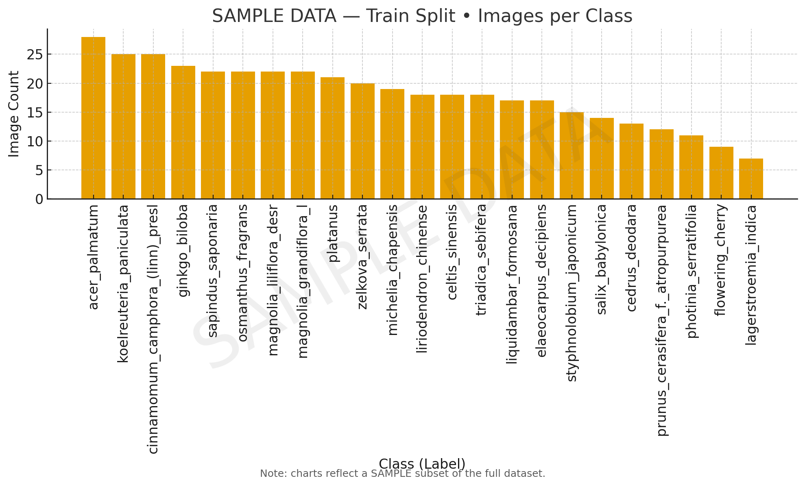

# Metadata
# Data Summary 
This dataset was created to investigate the research question: What is the best classifier model for tree images? It captures images of 23 labeled tree species obtained from Dataset Ninja [1]. 

The dataset enables machine learning models to perform tree species classification and further supports research into urban biodiversity and environmental monitoring. 

- Initial Data: The dataset is stored in a zip folder with a separate test, train, and val folder that was split by the original project authors. Within the separate folders, it contains the img folder with the actual images and an ann folder containing the classifiers for each tree species.
- Final Data: The dataset will be stored in a single directory with a 70-20-10 proportional split. 

# Provenance
Our dataset comes from the publicly available "Urban Street: Tree Classification Dataset" hosted on Dataset Ninja. The images were collected by the original dataset creators in 10 cities across China between February and October 2022, using mobile devices to capture 23 tree species across multiple seasons. We downloaded the dataset directly from Dataset Ninja, first using the sample version to test our pipeline and then using the full 4,804-image dataset. The original dataset includes pre-made train/val/test folders, but for our analysis, we reorganized the images into a single directory and applied our own 70-20-10 proportional split. Other than restructuring the folders for reproducibility, we did not alter the raw image content. The dataset and our processed version are stored in our project's GitHub repository to ensure transparency and traceability. 

# License 
The source dataset, titled "Urban Street: Tree Classification Dataset," was accessed through Dataset Ninja's public site and data explorer interface. The dataset is distributed under the GNU LGPL 3.0, which permits sharing, adaptation, and redistribution, provided that the original creator, title, publication year, and dataset URL are properly credited [1]. This allows our group to freely utilize and publish insights derived from the dataset for educational and research purposes while maintaining appropriate attribution. 

# Ethical Statements 
N/A

# Data Dictionary 
**___TO-DO___**

# Explanatory Plots 

# References 
[1] https://datasetninja.com/urban-street-tree-classification, “Urban Street: Tree Classification - Dataset Ninja,” Dataset Ninja, 2022. http://datasetninja.com/urban-street-tree-classification#download (accessed Nov. 05, 2025).

[2] K. He, X. Zhang, S. Ren, and J. Sun, “Deep Residual Learning for Image Recognition,” arXiv.org, Dec. 10, 2015. https://arxiv.org/abs/1512.03385 

[3]P. Baheti, “Train, Validation, and Test Set: How to Split Your Machine Learning Data,” V7labs.com, Sep. 13, 2021. https://www.v7labs.com/blog/train-validation-test-set

[4]scikit learn, “3.1. Cross-validation: Evaluating Estimator Performance — scikit-learn 0.21.3 Documentation,” Scikit-learn.org, 2009. https://scikit-learn.org/stable/modules/cross_validation.html

[5] GeeksforGeeks. 2025. “Evaluation Metrics in Machine Learning.” GeeksforGeeks. July 15, 2025. https://www.geeksforgeeks.org/machine-learning/metrics-for-machine-learning-model/.

[6] “Using UVA’s High-Performance Computing Systems | Research Computing,” Virginia.edu, Dec. 03, 2024. https://www.rc.virginia.edu/userinfo/hpc/
